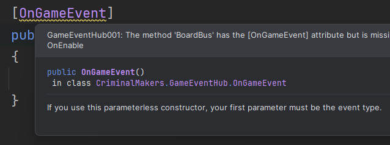
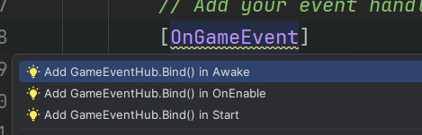

# 1.3.1

- Fixed Unity 6 warning message about deprecated **FindObjectsOfType**.

## General

- Added `Roslyn Analyzer` to check for common mistakes and provide suggestions in the IDE.

- Added `Roslyn Code Fix` to automatically fix common mistakes in the IDE.

- Fixed `DontDestroyOnLoad` not working when `Game Event Hub` had a parent object.

- Added `Ensure Single Instance` option to `Game Event Hub`. The older instance will be kept if a new instance is created.

- Added `Create Game Event Hub` to the `+` menu in the hierarchy window. (Will only work if there is no `Game Event Hub` in the scene.)

### Roslyn Analyzer Analyzer Rules

- **GameEventHub001**: Triggers when a method with the `[OnGameEvent]` attribute is found, but there is no corresponding `GameEventHub.Bind()` method in `Awake`, `Start`, or `OnEnable`. Also checks ancestor classes.

- **GameEventHub002**: Triggers when a `GameEventHub.Bind()` method exists, but no matching `GameEventHub.Unbind()` method is found in `OnDisable` or `OnDestroy`. Checks ancestor classes as well.

- **GameEventHub003**: Triggers when a method with `[OnGameEvent]` lacks an event type declared in the attribute parameter or method signature. Also triggers if the event type does not inherit from `GameEvent`.

- **GameEventHub004**: Triggers when a `new YourEvent().Publish()` method is called without specifying the emitter. Emitters are required to be passed as a parameter to the `Publish()` method or using `SetEmitter()`.

## Your feedback matters!

We are constantly improving the asset and would love to hear your feedback! If you like the asset, please consider leaving a `5* review.`

[Unity Asset Store](https://assetstore.unity.com/packages/slug/303196). 

If you have any questions, suggestions, or issues, please send us an email.

[Email](mailto:support@criminal-makers.com)