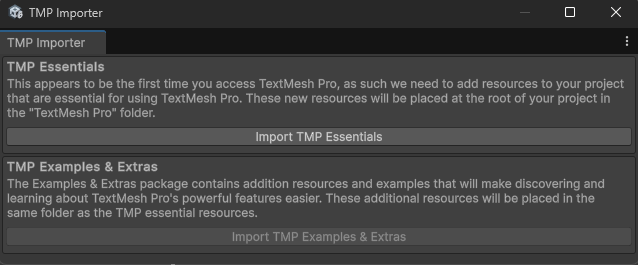

# Welcome to the examples

This is a collection of examples that demonstrate how to use basic and advanced features of the Game Event Hub.

You can find these examples in the `Game Event Hub/Examples` folder.

> Note: The difficulty of the examples is progressive, so it's recommended to follow them in order.

> Important: Examples *REQUIRE* TextMeshPro installed. If you don't have it, you can trigger the installation popup by clicking on any UI Text element that uses TextMeshPro in the example scenes. Make sure to import TMP essentials.

