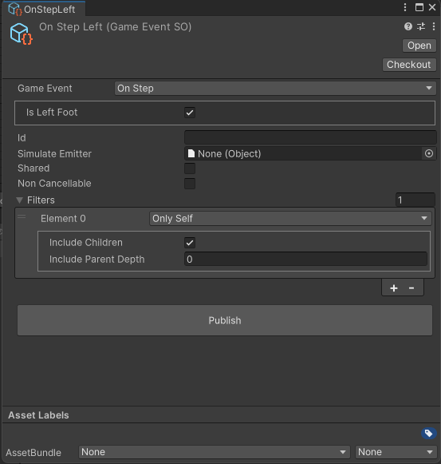

# 07. Emit from Animator State

This example shows how to emit an event from an `Animator` state.


## See it in action

1. Open the scene under `Game Event Hub/Examples/07 Emit Animator`

2. Start the game.

3. Move the player holding `SPACE` key

4. You should see `feets of the player highlighted`, `step count UI increasing` and `step announcer` on the right.

5. Move the NPC holding the `F` key

6. You should see `feets of the NPC highlighted`.

> Notice how the player and the NPC publish the same events, but the feet highlight doesn't collide between them.


## Walk controller

- Check in the `Hierarchy` for a GameObject named `Player` or `NPC` and open the script `WalkController.cs`

```chsarp
public class WalkController : MonoBehaviour
{
    public Animator animator;
    public KeyCode walkKey = KeyCode.Space;

    // Update is called once per frame
    void Update()
    {
        if (Input.GetKeyDown(walkKey)) animator.CrossFade("Walking", 0.2f);

        if (Input.GetKeyUp(walkKey)) animator.CrossFade("Idle", 0.2f);

        var randomSpeed = UnityEngine.Random.Range(0.5f, 1.5f);
        animator.SetFloat(SpeedParameter, randomSpeed);
        
    }
}
```

The `WalkController` listens for key inputs to transition between `Walking` and `Idle` Animator states and sets a random `Speed` parameter for demonstration purposes.


## Animator

Open the `Walking` animator from the `Animator` component (or the `Art` folder) and inspect the `Walking` state.


The `Walking` state has a `PublishOnPlayback` behaviour that has two events as `Game Event SO`. This events will be published when the `time` of the state is reached.


If you `Right Click > Properties` on each you can see the `Game Event` that is being published.




## The OnlySelf filter

The `OnlySelf` filter ensures that the event is **only received by the emitter itself and its children**. This prevents interference between entities, such as the player and NPC walking simultaneously.


## Step displayer

- Inside the `Hierarchy`, in one of the characters (Player or NPC), drill down until you find the `Step displayer` script.

```csharp
public class StepDisplayer : MonoBehaviour
{
    public MeshRenderer meshRenderer;
    public bool leftStep = false;
    
    private void OnEnable()
    {
        Hide();
        GameEventHub.Bind(this);
    }

    private void OnDisable()
    {
        GameEventHub.Unbind(this);
    }

    [OnGameEvent]
    public void OnStep(OnStep e)
    {
        if (e.isLeftFoot != leftStep) return;
        
        meshRenderer.enabled = true;
        
        Invoke(nameof(Hide), 0.1f);
    }

    private void Hide()
    {
        meshRenderer.enabled = false;
    }
}
```

The `StepDisplayer` listens for `OnStep` events and quickly shows the foot's `MeshRenderer`


## Accessing Animator Properties

During the event emission, any property of type `Animator` will be `automatically filled`.

This way, the `SpeedDisplayer` script can access the `speed` (or any other) parameter or method from the `Animator` component.


## Why the UI receives the event, even if it's not a child of the emitter?

Both `StepCounter` and `StepAnnouncer` scripts are subscribing to the event as `Essential`. This means that they will always receive the event, regardless of the filter.

```csharp
public class StepCounter : MonoBehaviour
{
    [OnGameEvent(SubscriberPriority.Essential)]
    private void OnPlayerStep(OnStep e)
    {
        // Ignore events from non-components
        if (e._emitter is not Component) return;
        
        var componentEmitter = (Component) e._emitter;
        
        // Ignore events from non-players
        if(!componentEmitter.gameObject.CompareTag("Player")) return;
        
        stepCount++;
        countText.text = $"Step count: {stepCount}";
    }
}