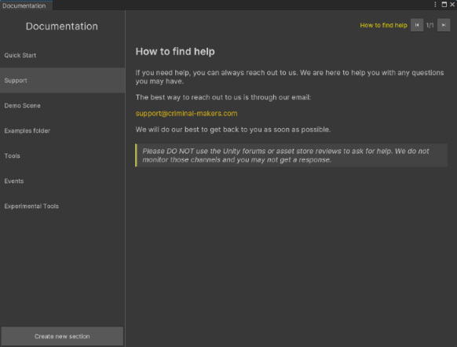

# Documentation (this window)

`Tools > Game Event Hub > Documentation`



This tool allows you to see the Game Event Hub documentation. Documentation is written in markdown and grouped by `DocumentationSection` scriptable object.

While is it not recommended to modify the included documentation, and `GameEventHub` is not a documentation tool itself, you can use this tool as light documentation tool for your own purposes.


## Creating your own documentation section

1. Press the `Create new section` button

2. Save the asset

3. Assign a title and the order index

4. Create a markdown file (`.md`) and assign it as an element of the `Documentation Items` list. Each element will be a page in the documentation.

5. Close and reopen the tool to see the changes.


## Supported markdown

While the markdown is not fully supported, there are a finite number of elements that are supported:

%%- Headers #

%%- Images  (relative to the markdown file)

%%- Videos  (relative to the markdown file)

%%- Emphasis _italic_ **bold** and `highlight`

%%- > Blockquotes

%%- Blockcode ``` code ``` (very limited code highlighting)


## Removal of documentation

You can safely remove the `Documentation` folder in the `GameEventHub` folder to remove the documentation from the project and this tool. This will not affect the functionality of the Game Event Hub.