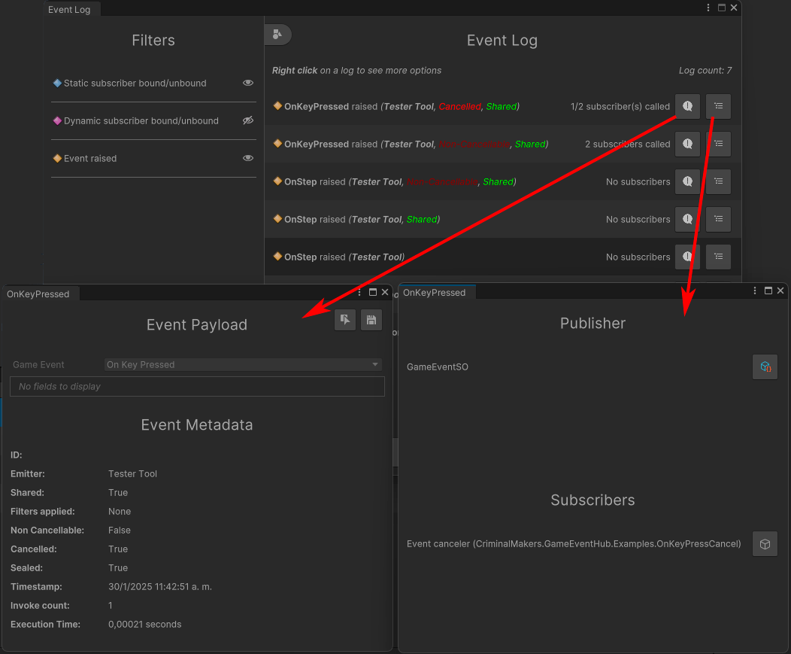

# Event Log

Old `Tools > Game Event Hub > Log` 
New `Tools > Game Event Hub > Experimental > New Log`

> Note: Won't log events during frame 0 (initialization of the game).

The event log monitor let's you see all the events that are happening in your system. This is useful for debugging and monitoring purposes.

This screen is split in two, the left side has `Filters` that you can extend and on the right side you have the `Log` itself.

**On the right screen you can see the following information:**

- `Type of event` (Static subscriber bound / unbound, Dynamic subscriber bound / unbound, event raised)

- Relevant `metadata` of the event (cancelled, shared, non-cancellable, etc)

- `Number of subscribers` called

- Button to `Open event detail` (Payload and metadata)

- Button to `Open list of subscribers and emitter`.

- Button to `clear log`

- `Number of entries` in the log.

> You can also right click on an entry to access additional options and the timestamp.