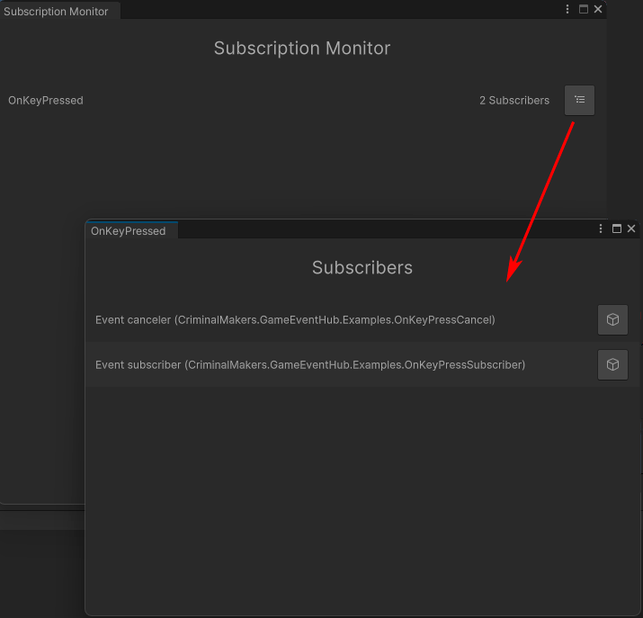

# Monitor

`Tools > Game Event Hub > Monitor`

The monitor tool let you see in real time subscribers of events.

1. Name of the event. If the event has no subscribers, it won’t appear here.

2. Number of total subscribers (dynamic + static)

3. Button to show list of subscribers

4. Name of the subscriber. For Monobehaviour: Game Object (Script class)

7. Button to ping object in the hierarchy (if available)
