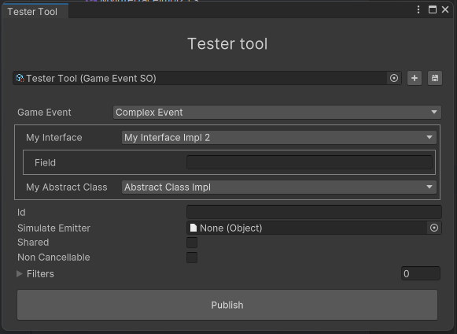

# Tester

`Tools > Game Event Hub > Tester`



> Note: In order to use this tool, your events must have a parameterless constructor.

> Note2: When exitting play mode, TestTool may throw some warnings because Unity clears the memory of the objects. This is normal and won't affect your game.

The tester tool allows you to publish events from the editor. This is useful for testing and debugging purposes.

If used alongside with the `[SubclassSelector]`, you can fully serialize and display `Interfaces` and `Abstract classes`

```csharp

public class ComplexEvent: GameEvent
{
    [SerializeReference, SubclassSelector] // <-- By default, it will draw properties
    public IMyInterface myInterface;

    [SerializeReference, SubclassSelector(false)] // <-- Do not draw properties
    public MyAbstractClass myAbstractClass;
}

```