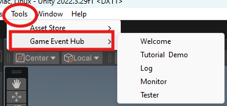

# Tools and where to find them

`GameEventHub` provides a set of tools to help you debug and monitor the event mechanism. There are three main tools: **Monitor**, **Event Log** and **Tester**.

You can find these tools under `Tools > Game Event Hub` dropdown menu.

