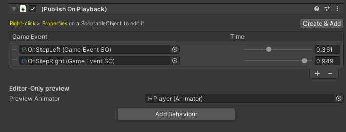

# PublishOnPlayback - Animator State Behaviour

This behaviour is used inside `AnimatorController > State` to publish events when the animation is played. It's useful to trigger events when the animation reaches a specific frame.

You can set:

- List of `GameEventSO` and `Time` to publish

- Create new `GameEventSO` using the `Create & Add` button

- `Preview` the animation in the `Scene view`, by assigning an `Animator` to the `Preview Animator` field

> Note: There is +/- 0,05 seconds of tolerance to keep the events working in poor frame rate scenarios. You can adjust this value in the PublishOnPlayback.cs script.

> Tip: If your event has any property of type `Animator`, it will be automatically filled with the Animator component. This is useful to get or set parameters from the Animator.