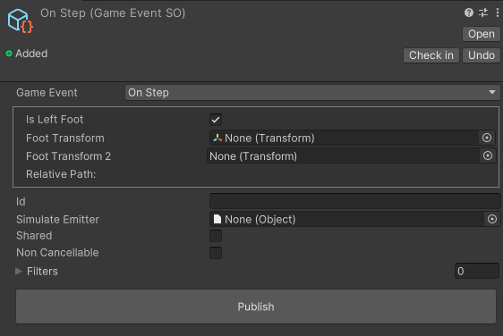

# Game Event ScriptableObject

You can save game events in a Scriptable Object. This is useful for triggering events from the inspector like `UnityEvents`, but you can also use it to save events to trigger late in the `Test Tool`.

There are a few ways to create a Game Event SO:

- Right-click in the project window and select `Create > Game Event Hub > Game Event ScriptableObject`.

- From the `Log tool` right click on a `Event raised` line and select `Save event as ScriptableObject`

- From the `Tester tool` click on the `disk` icon.

- From the `Event Payload / Metadata` click on the `disk` icon.