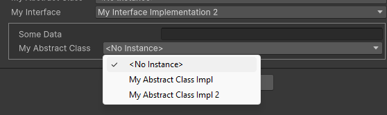

# [SubclassSelector]

Subclass selector is an attribute with a custom property drawer that allows you to select a subclass of a given type and expose its properties in the inspector.

Exposing abstract class:

```csharp

[SerializeReference, SubclassSelector]
public AbstractClass mySubclass;

```

Exposing interface:

```csharp

[SerializeReference, SubclassSelector]
public IMyInterface myInterface;

```

You can even nest the attribute to expose subclasses of subclasses. Result is this:



> Note: You can pass as attribute first argument a boolean to show or hide the properties of the selected subclass.

> Note 2: You can exclude types from the list, by marking them with the attribute `[ExcludeTypeFromSubclassSelector]`.
