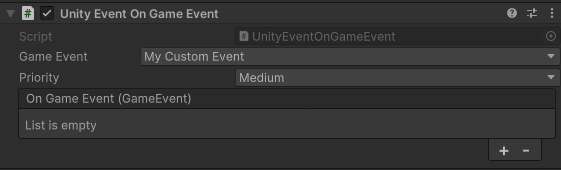

# UnityEvent on GameEvent

This is a simple script that allows you to subscribe to a `GameEvent` and raise a `UnityEvent` when the `GameEvent` is received.

You can set:

- `GameEvent` to subscribe to.

- `Priority` of the subscription.

- `UnityEvent` actions to raise when the `GameEvent` is received.

> Note: GameEvent payload is passed as parameter to the UnityEvent, but it's abstract. You need to cast it to the correct type.